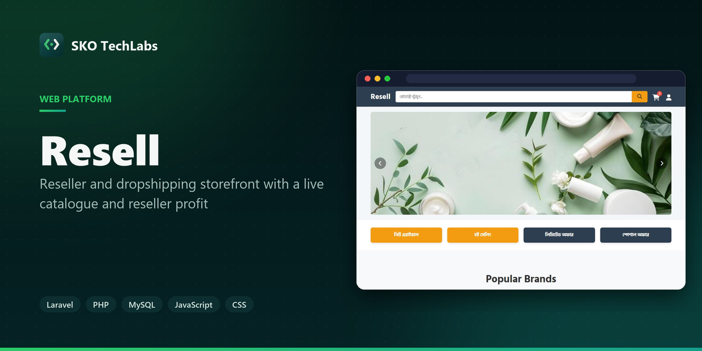
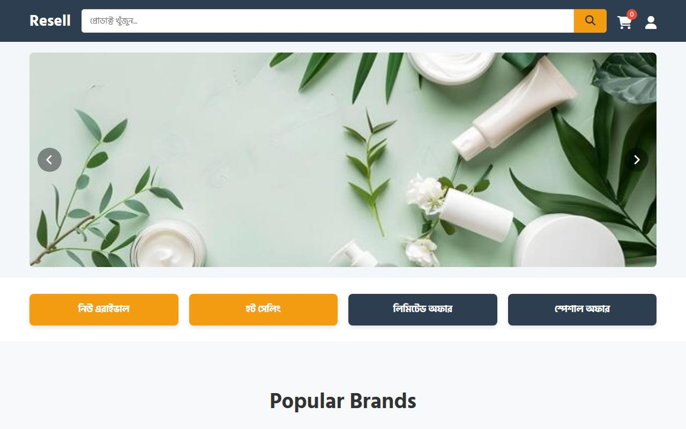

<h3>Reseller and dropshipping storefront with a live catalogue and reseller profit</h3>

Bangla-first storefront where anyone can register as a reseller, order from a live catalogue and sell on without holding any stock.

   

<a href="https://reseller1.skotechlabs.com"><b>Live Demo</b></a> &nbsp;·&nbsp; <a href="https://skotechlabs.com/projects/resell-reseller-dropshipping-storefront"><b>Case Study</b></a> &nbsp;·&nbsp; <a href="https://skotechlabs.com/contact"><b>Request a Demo</b></a> &nbsp;·&nbsp; <a href="https://github.com/skotechlabs"><b>All Products</b></a>

---

## Overview

A storefront and a reseller panel sharing one catalogue. Customers shop the normal way; resellers register, get their own panel, and place orders against the same products without carrying inventory themselves.

The interface is Bangla throughout, with brand and category browsing, offer rails for new arrivals and limited-time deals, and support routed straight to WhatsApp and Telegram where the customers already are.

<table>
<tr>
<td width="50%" valign="top">

### The Challenge

Reselling here runs on screenshots in group chats. Prices go stale, stock is a guess, and the person actually shipping has no reliable list of who ordered what.

</td>
<td width="50%" valign="top">

### Our Solution

A single catalogue both sides read from. Resellers get a panel instead of a chat thread, orders arrive structured, and prices and availability come from one place so they cannot drift.

</td>
</tr>
</table>

## Key Features

- Reseller registration and dedicated panel
- Brand and category browsing with sorting
- New arrival, hot selling and limited offer rails
- Cart, checkout and order history
- Bangla interface with taka pricing
- WhatsApp and Telegram support routing
- Admin control over products, categories and offers

## Business Impact

- Resellers order from a live catalogue instead of screenshots
- One product list serving both retail and reseller pricing
- Offer rails change without editing the front page
- Bangla interface throughout, priced in taka

## Screenshots

<table>
<tr>
<td width="50%" valign="top"> Resell: Reseller and dropshipping storefront with a live catalogue and reseller profit</td>
<td width="50%"></td>
</tr>
</table>

> See it running: **[reseller1.skotechlabs.com](https://reseller1.skotechlabs.com)**

## Technology Stack

## Source Code & Licensing

This repository is the public showcase for **Resell**. The production source code is proprietary and is maintained privately by SKO TechLabs.

Interested in this product for your business? We offer:

- **Ready-to-launch deployment** of Resell under your own brand and domain
- **Customisation** of features, workflows, languages and integrations to fit how you work
- **Custom development** of a new product built on the same foundations
- **Ongoing support**, hosting, maintenance and feature roll-outs after launch

## Get in Touch

---

© 2026 <a href="https://skotechlabs.com">SKO TechLabs</a> · Dhaka, Bangladesh · Building intelligent digital solutions

